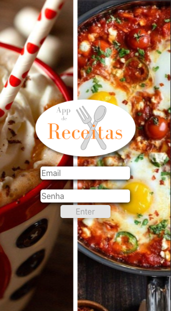
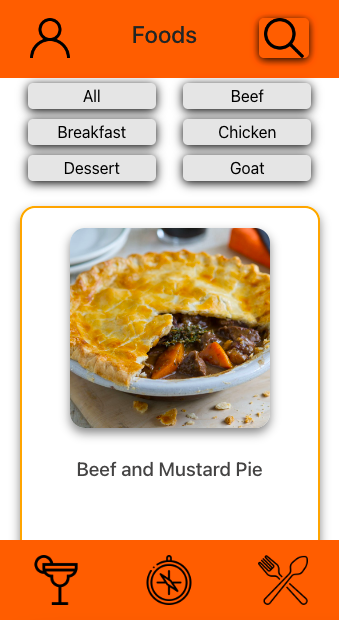
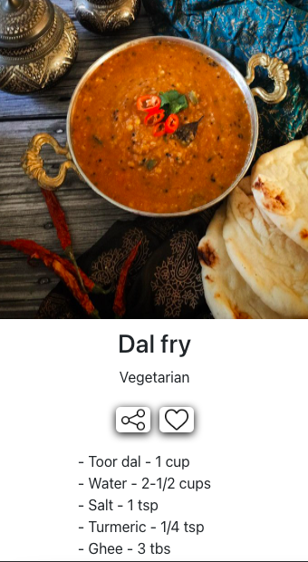

# AppRecipes

### Projeto realizado durante o módulo de Front-end na Trybe 💚
---
### Tecnologias utilizadas:

  
  
  

Aplicação de pesquisa de receitas utilizando a API [TheMealDB](https://www.themealdb.com/api.php) e [CockTailDB](https://www.thecocktaildb.com/api.php). 

---
### Sobre o desenvolvimento:
- Grupo;
- Utilizamos React Hooks;
- Optamos pelo uso de Context para gerenciamento de estado.
---
### Equipe:
* [ApoloRezende](https://github.com/ApoloRezende)
* [AugustoMagalhaes](https://github.com/AugustoMagalhaes)
* [Cecilia Martins](https://github.com/cecilia-martins)
* [Jatoba Bispo](https://github.com/jatobabispo)

---

